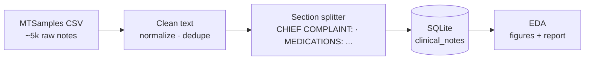
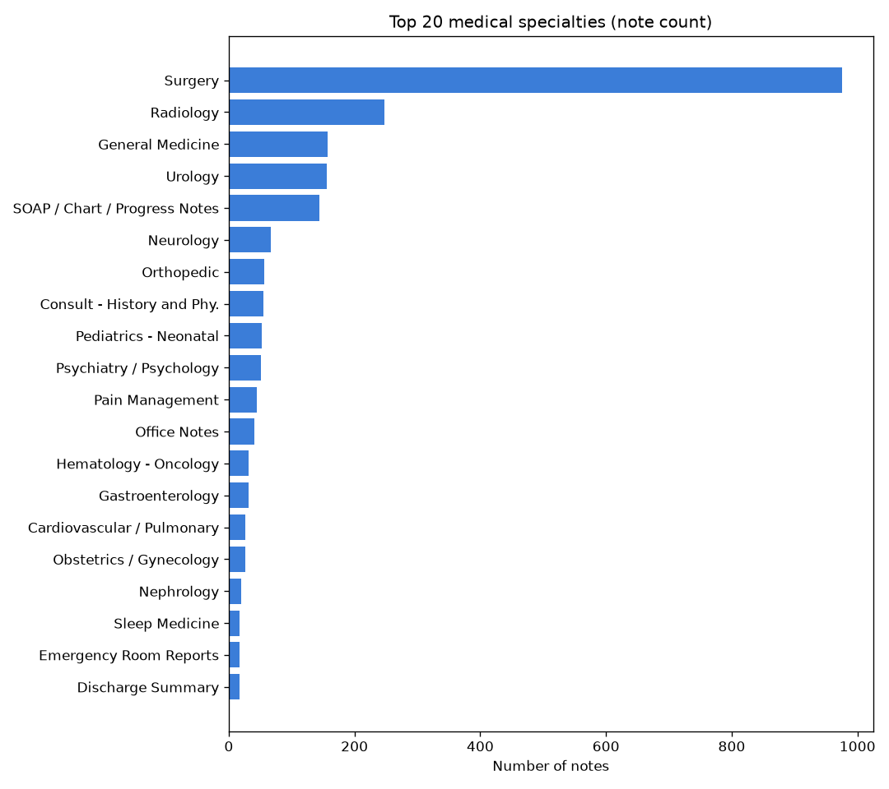
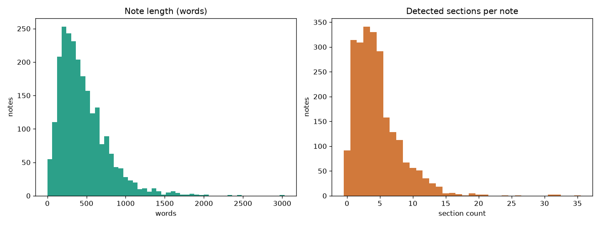
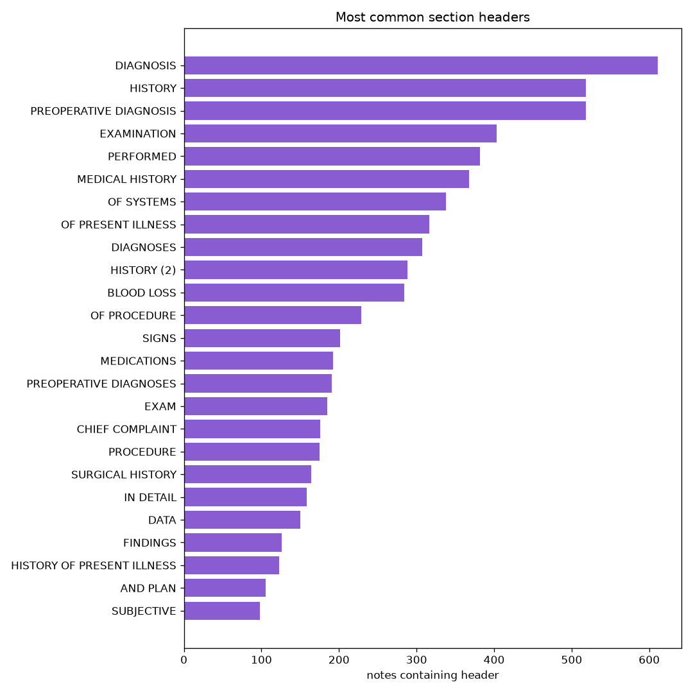

# CuraVerify — Clinical NLP

> **Turning unstructured clinical text into structured, verifiable medical facts.**
> A hands-on Natural Language Processing project built on real transcribed medical reports.


-8a5cd1)


---

## 1. What is this project?

Doctors write **free-text notes** — chief complaints, histories, medications,
assessments. This project applies **Natural Language Processing (NLP)** to those
notes to automatically pull out the clinically important facts (diseases,
medications, tests) and, ultimately, to **verify** whether a machine-generated
summary of a note is faithful to the original.

It is the **clinical-domain arm of CuraVerify**, a hallucination-detection
framework. The same architecture also runs on scientific papers (see
[`PROJECT_PLAN.md`](PROJECT_PLAN.md)) — so this repo is a **two-domain NLP system**.

### Why this is a Natural Language Processing project

| NLP task | Where it appears | Status |
|---|---|---|
| Text cleaning & normalization | Day 1 | ✅ |
| Document sectioning (parsing note structure) | Day 1 | ✅ |
| Named Entity Recognition (diseases, meds, tests) | Day 2 | ⏳ |
| Negation detection ("*no* chest pain") | Day 2 | ⏳ |
| Entity linking to medical concepts (UMLS) | Day 2 | ⏳ |
| Relation extraction ("metformin → treats → diabetes") | Day 3 | ⏳ |
| Claim verification / faithfulness grounding | Day 3 | ⏳ |

> **One-line summary for a viva:** *"I take unstructured medical transcriptions and
> apply text preprocessing, named-entity recognition, negation handling, and relation
> extraction to turn free-text notes into structured, verifiable clinical facts."*

---

## 2. The dataset

**MTSamples** — ~5,000 real, publicly shared, already de-identified transcribed
medical reports spanning many specialties (cardiology, radiology, surgery, …).
No credentialing and no patient-privacy risk, so the project is fully reproducible.

A raw note looks like this (semi-structured free text):

```
CHIEF COMPLAINT: Chest pain.
HISTORY OF PRESENT ILLNESS: A 54-year-old male presents with 2 hours of
substernal chest pain radiating to the left arm.
PAST MEDICAL HISTORY: Hypertension, type 2 diabetes.
MEDICATIONS: Metformin 500 mg, Lisinopril 10 mg.
ALLERGIES: Penicillin.
ASSESSMENT: Acute coronary syndrome.
PLAN: Admit to telemetry, serial troponins, aspirin.
```

---

## 3. Day 1 — Data acquisition + Exploratory Data Analysis (EDA)

**Goal:** get real clinical text loaded, cleaned, and understood before doing any modeling.

### Pipeline



### What Day 1 produces

- `clinical/data/clinical.db` — cleaned notes in a `clinical_notes` table
- `clinical/results/eda_report.md` — text summary of the corpus
- Three EDA figures (below)

### Screenshots

**Specialty distribution** — how many notes per medical specialty (shows real-world class imbalance):



**Note length distribution** — words per note and detected sections per note (informs chunking for later NLP models):



**Most common section headers** — the ALL-CAPS anchors (`MEDICATIONS:`, `ASSESSMENT:`, …) our sectioner detects; Day 2 NER attaches entities to these sections:



> These images are generated by the pipeline into `clinical/results/`. Run Day 1
> (below) **before** pushing so they render here on GitHub.

### `clinical_notes` schema

| column | meaning |
|---|---|
| `sample_name` | e.g. "Cardiology Consult - 1" |
| `description` | one-line description |
| `medical_specialty` | normalized specialty label |
| `keywords` | comma-separated keywords |
| `transcription` | cleaned full note text |
| `char_count` / `word_count` | length metrics |
| `section_count` | number of detected sections |
| `sections_json` | JSON `{header: body}` |

---

## 4. Reproduce Day 1 (Quickstart)

Requires Python 3.10+. From the repo root:

```bash
# 1) install dependencies (use the py launcher on Windows)
py -m pip install -r clinical/requirements.txt

# 2) run the whole Day 1 pipeline: download -> clean -> load -> EDA
py -m clinical.run_day1
```

Or explore interactively:

```bash
jupyter notebook clinical/notebooks/clinical_01_eda.ipynb
```

Expected console output (example):

```
========================================================================
 CuraVerify Clinical — Day 1: data acquisition + EDA
========================================================================
[1/3] Acquiring MTSamples ...
[download] Reusing existing valid file: .../mtsamples.csv
[2/3] Loading + cleaning into SQLite ...
[load] rows: 4999 raw -> 3898 kept (dropped 33 empty, 1068 duplicates)
[load] Inserted 3898 notes -> .../clinical.db
=== Quick summary ===
Notes:            3898
Specialties:      40
Median words:     ...
[3/3] Running EDA ...
[eda] wrote .../eda_specialties.png
[eda] wrote .../eda_lengths.png
[eda] wrote .../eda_section_headers.png
[eda] wrote .../eda_report.md
```

---

## 5. Repository structure

```
CuraVerify/
├── README.md                   ← you are here (project front page)
├── LICENSE
├── PROJECT_PLAN.md             ← full architecture & scientific-paper arm
├── ARCHITECTURE.md / DATA_SCHEMA.md / EVAL_PLAN.md / PROMPTS.md
│
└── clinical/                   ← the clinical NLP arm
    ├── README.md               ← clinical-arm details
    ├── requirements.txt
    ├── run_day1.py             ← Day 1 orchestrator
    ├── src/
    │   ├── config.py           ← paths, dataset URLs
    │   ├── download_data.py    ← resilient MTSamples fetch
    │   ├── sectioner.py        ← section splitter (reused Day 2+)
    │   ├── load_mtsamples.py   ← clean · section · load -> SQLite
    │   ├── db.py               ← clinical_notes schema
    │   └── eda.py              ← figures + report
    ├── notebooks/
    │   └── clinical_01_eda.ipynb
    ├── data/                   ← (gitignored) raw csv + clinical.db
    └── results/                ← EDA figures + report (committed for README)
```

---

## 6. Roadmap

| Day | Focus | NLP learned | Status |
|---|---|---|---|
| **1** | Data + EDA | text cleaning, sectioning, corpus profiling | ✅ done |
| 2 | Clinical NER | NER, negation, UMLS entity linking (scispaCy/medspaCy) | ⏳ next |
| 3 | Knowledge graph + verifier | relation extraction, evidence grounding | 🔜 |
| 4 | Streamlit demo + writeup | end-to-end app | 🔜 |

---

## 7. Data & ethics note

MTSamples transcriptions are publicly shared and already de-identified. The raw
CSV and database are **gitignored** by default; only code and generated figures
are committed. For real electronic health records (MIMIC-IV, n2c2), obtain the
required PhysioNet credentialing — the same pipeline accepts them via a new loader.

## 8. References

- **MTSamples** — publicly available transcribed medical reports (mtsamples.com).
- **CuraView** — Ye, S. et al. (2025). *A Knowledge-Based Multi-Agent Framework for
  Patient-Grounded Medical Hallucination Detection.* SSRN 7065322.
- **scispaCy** — Neumann et al. (2019). *ScispaCy: Fast and Robust Models for
  Biomedical NLP.*
