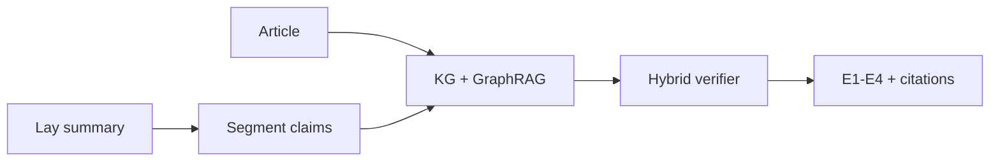

# CuraVerify

> **Paper-grounded scientific summary faithfulness verification**  
> A domain port of [CuraView](https://ssrn.com/abstract=7065322) (GraphRAG + E1–E4 evidence grading) to **BioLaySumm** biomedical articles and lay summaries.

[](https://huggingface.co/spaces/sahil143-dotcom/CuraVerify)


### What this proves (for viva / grading)

1. **Unstructured → structured** — lay-summary sentences become claim-level verdicts with evidence citations.  
2. **Paper grounding** — per-article knowledge graph + GraphRAG-style retrieval supplies support for each claim.  
3. **Faithfulness grades** — CuraView **E1–E4** plus scientific hallucination types (`wrong_value`, `wrong_method`, …).

**Live demo:** open the [Hugging Face Space](https://huggingface.co/spaces/sahil143-dotcom/CuraVerify), pick a **[HALL]** sample, click **Run verification**, and inspect E1–E4 grades.

---

## CuraView 6-stage pipeline (implemented)

| Stage | CuraView | CuraVerify |
|---|---|---|
| 1 Input | Discharge text | Lay summary to verify; article = source |
| 2 Segment | Sentences | Sentence + atomic claims |
| 3 Evidence | Patient GraphRAG | Per-article KG + snippet retrieval |
| 4 Judge | LLM verifier | Hybrid rules (+ optional LLM) |
| 5 Grade | E1–E4 + types | E1–E4 + 5 scientific types |
| 6 Emit | Structured JSON + QC | Pydantic models + document verdict |



---

## Quickstart (local — same code as the Space)

```powershell
cd D:\CuraVerify
py -m venv .venv
.\.venv\Scripts\python.exe -m pip install -r scientific\requirements.txt

# Product UI
.\.venv\Scripts\streamlit.exe run scientific\app.py

# Full offline pipeline (load → KGs → hallucinate → verify → metrics)
.\.venv\Scripts\python.exe -m scientific.run_pipeline
```

Outputs (after `run_pipeline`):
- `scientific/data/scientific.db` — 6,763+ papers/summaries
- `scientific/data/knowledge_graphs/*.gpickle` — 200 article KGs
- `scientific/results/eval_table.md` — GraphRAG vs flat metrics

Deploy notes: [scientific/DEPLOY.md](scientific/DEPLOY.md) · details: [scientific/README.md](scientific/README.md)

---

## Dataset

**BioLaySumm 2025 Task 1** ([biolaysumm.org](https://biolaysumm.org/)):
- **eLife** + **PLOS** article ↔ expert lay summary pairs
- Demo Space uses bundled `scientific/data/demo_samples.json` (truncated REAL + HALL pairs)

Clinical arm (MTSamples Day 1 EDA) lives under [`clinical/`](clinical/) and is separate from this scientific product.

---

## Repository map

```
CuraVerify/
├── app.py                 ← HF Spaces / Streamlit entrypoint
├── requirements.txt       ← lean demo deps
├── README.md
├── scientific/            ← 6-stage product (BioLaySumm)
│   ├── app.py             ← product UI
│   ├── data/demo_samples.json
│   ├── results/           ← eval metrics shown in the demo
│   └── DEPLOY.md
└── clinical/              ← MTSamples clinical NLP Day 1
```

---

## References

- Ye et al. *CuraView: Medical Hallucination Detection with GraphRAG.* SSRN 7065322 / arXiv:2605.03476
- BioLaySumm shared task (BioNLP @ ACL)
- Goldsack et al. *Making Science Simple* (EMNLP 2022) — PLOS / eLife lay summarization corpora
