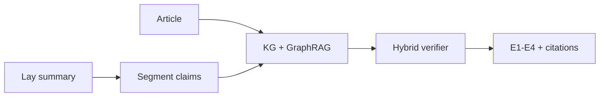

# CuraVerify

> **Paper-grounded scientific summary faithfulness verification**  
> A domain port of [CuraView](https://ssrn.com/abstract=7065322) (GraphRAG + E1–E4 evidence grading) to **BioLaySumm** biomedical articles and lay summaries.


---

## CuraView 6-stage pipeline (implemented)

| Stage | CuraView | CuraVerify |
|---|---|---|
| 1 Input | Discharge text | Lay summary to verify; article = source |
| 2 Segment | Sentences | Sentence + atomic claims |
| 3 Evidence | Patient GraphRAG | Per-article KG + snippet retrieval |
| 4 Judge | LLM verifier | Hybrid rules (+ optional LLM) |
| 5 Grade | E1–E4 + types | E1–E4 + 5 scientific types |
| 6 Emit | Structured JSON + QC | Pydantic models + document verdict |



---

## Quickstart (complete product)

```bash
cd D:\CuraVerify
py -m pip install -r scientific/requirements.txt

# End-to-end: load BioLaySumm → build KGs → hallucinate eval set → verify → metrics
py -m scientific.run_pipeline

# Interactive demo
streamlit run scientific/app.py
```

Outputs:
- `scientific/data/scientific.db`
- `scientific/data/knowledge_graphs/*.gpickle`
- `scientific/results/eval_table.md`

Details: [scientific/README.md](scientific/README.md)

---

## Dataset

**BioLaySumm 2025 Task 1** ([biolaysumm.org](https://biolaysumm.org/)):
- **eLife** + **PLOS** article ↔ expert lay summary pairs
- Loaded from `scientific/data/biolaysumm/` (train/val; test gold summaries are blank by design)

Clinical arm (MTSamples Day 1 EDA) lives under [`clinical/`](clinical/) and is separate from this scientific product.

---

## Repository map

```
CuraVerify/
├── README.md
├── PROJECT_PLAN.md / ARCHITECTURE.md / PROMPTS.md / EVAL_PLAN.md / DATA_SCHEMA.md
├── scientific/          ← complete 6-stage product (BioLaySumm)
└── clinical/            ← MTSamples clinical NLP Day 1
```

---

## References

- Ye et al. *CuraView: Medical Hallucination Detection with GraphRAG.* SSRN 7065322 / arXiv:2605.03476
- BioLaySumm shared task (BioNLP @ ACL)
- Goldsack et al. *Making Science Simple* (EMNLP 2022) — PLOS / eLife lay summarization corpora
